# Cognitive Thinking in AI
## A Comprehensive Overview: From Human Cognition to Intelligent Automation

---

## Table of Contents
1. Introduction & Overview
2. Human Cognitive Thinking: Historical & Psychological Perspectives
3. Cognitive AI in Consumer Technology
4. Cognitive AI in Automation Suites
5. Root Cause Analysis Applications
6. Predictive Analysis & Forecasting
7. Prescriptive Analysis & Strategic Planning
8. Future Implications & Conclusions

---

## Slide 1: Title
### Cognitive Thinking in AI
**Exploring the Evolution from Human Cognition to Intelligent Automation**

*Presenter: [Your Name]*  
*Date: [Current Date]*  
*Duration: 20-30 minutes*

---

## Slide 2: Agenda
### Today's Journey
- **Part I:** Understanding Human Cognitive Thinking
  - Historical perspectives
  - Psychological foundations
- **Part II:** Cognitive AI in Modern Technology
  - Consumer applications
  - Automation transformations
- **Part III:** Business Applications
  - Root cause analysis
  - Predictive forecasting
  - Strategic prescriptive analytics

---

## Slide 3: Introduction - What is Cognitive Thinking?
### Defining the Foundation

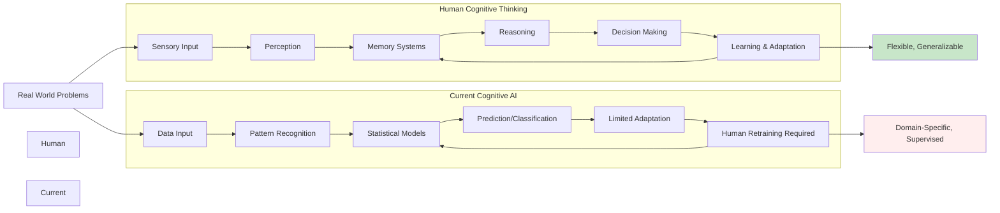

**Human Cognitive Thinking:**
Mental processes involving [perception, memory, reasoning, and decision-making](https://en.wikipedia.org/wiki/Cognition) that enable information processing, pattern recognition, and problem-solving. Human cognition is characterized by adaptive learning and the ability to generalize knowledge across diverse contexts. Unlike machines, humans can learn from limited examples and apply abstract reasoning to novel situations.

**Cognitive AI (Current Reality vs. Aspiration):**
AI systems that attempt to simulate aspects of human-like thinking processes by combining machine learning, natural language processing, and limited reasoning capabilities. Current "cognitive AI" is more accurately described as advanced machine learning with pattern recognition within trained domains. **Important Note:** True self-learning systems that can autonomously improve without human intervention remain largely aspirational; current production systems require human supervision, periodic retraining, and continuous oversight to maintain performance and safety.

---

## Slide 4: Historical Perspectives on Human Cognition
### Evolution of Understanding

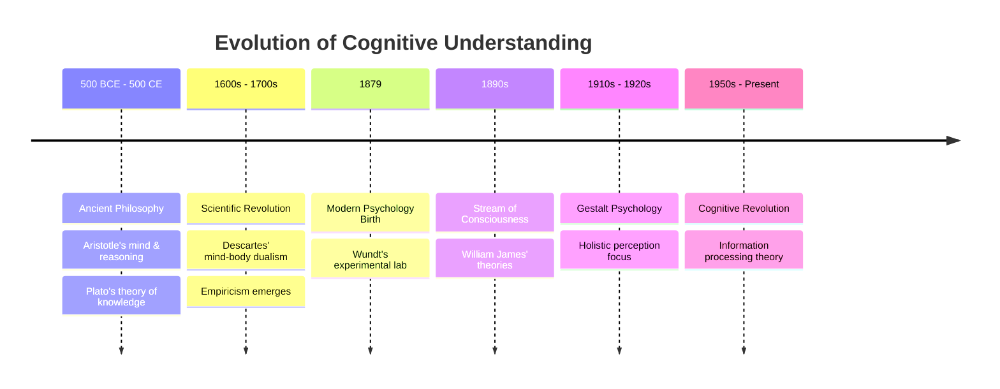

**Key Milestones:**
- **Ancient Philosophy (500 BCE - 500 CE):** [Aristotle's concept of mind and reasoning](https://en.wikipedia.org/wiki/Aristotle#Psychology), [Plato's theory of knowledge](https://en.wikipedia.org/wiki/Plato#Theory_of_knowledge)
- **Scientific Revolution (1600s-1700s):** [Descartes' dualism](https://en.wikipedia.org/wiki/Mind%E2%80%93body_dualism), Empiricism through experience
- **Modern Era (1879-Present):** [Wilhelm Wundt's lab](https://en.wikipedia.org/wiki/Wilhelm_Wundt), [William James' consciousness](https://en.wikipedia.org/wiki/William_James), [Gestalt psychology](https://en.wikipedia.org/wiki/Gestalt_psychology)

**References:**
- [History of psychology - Wikipedia](https://en.wikipedia.org/wiki/History_of_psychology)
- [The Origins of Psychology: History Through the Years - Verywell Mind](https://www.verywellmind.com/a-brief-history-of-psychology-through-the-years-2795245)

---

## Slide 5: Psychological Foundations
### Core Cognitive Processes

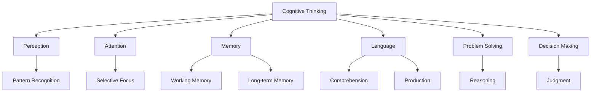

**References:**
- [Cognitive Psychology: The Science of How We Think - Verywell Mind](https://www.verywellmind.com/cognitive-psychology-4157181)
- [Cognitive Approach In Psychology - Simply Psychology](https://www.simplypsychology.org/cognitive.html)

---

## Slide 6: Cognitive Psychology Schools of Thought
### Key Theoretical Frameworks

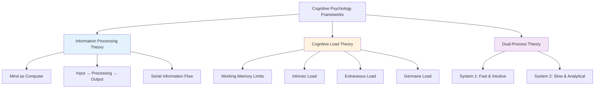

**[Information Processing Theory](https://en.wikipedia.org/wiki/Information_processing_(psychology)):**
The mind operates like a computer with sequential information processing stages: sensory input, encoding, storage, and retrieval. This framework revolutionized cognitive psychology by providing a structured model for understanding mental operations.

**[Cognitive Load Theory](https://en.wikipedia.org/wiki/Cognitive_load):**
Working memory has limited capacity (approximately 7±2 items). Three types of load affect learning: intrinsic (task complexity), extraneous (presentation method), and germane (schema construction). This theory is crucial for understanding AI system design and human-computer interaction.

**[Dual-Process Theory](https://en.wikipedia.org/wiki/Dual_process_theory):**
Human thinking operates through two systems: System 1 (automatic, fast, unconscious) and System 2 (controlled, slow, conscious). This framework helps explain both human cognitive biases and informs AI decision-making architectures.

**References:**
- [1.2 The Evolution of Psychology: History, Approaches, and Questions - Open Text BC](https://opentextbc.ca/introductiontopsychology/chapter/1-2-the-evolution-of-psychology-history-approaches-and-questions/)

---

## Slide 7: What is Cognitive AI? (Reality Check)
### Current Capabilities vs. Marketing Claims

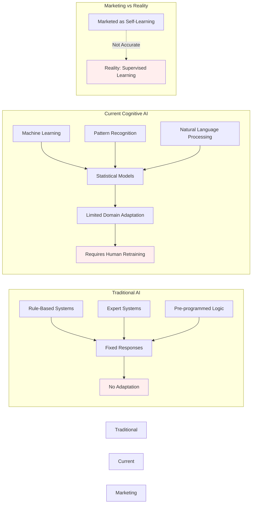

**Traditional AI (Rule-based):**
Traditional AI systems operate on explicitly programmed rules and logic trees created by human experts. These systems provide pre-programmed responses based on if-then conditions encoded during development. They exhibit limited adaptability because any changes to their behavior require manual reprogramming by developers. Their expertise remains narrow, confined strictly to the domain for which rules were written. While reliable within their constraints, these systems cannot learn from new experiences or adapt to scenarios not anticipated during their design phase.

**Current "Cognitive AI" (More Accurate Term: Advanced ML):**
Modern AI systems leverage machine learning algorithms that recognize patterns in training data rather than following explicit rules. These systems can identify correlations and make predictions based on statistical models learned from historical data. However, their adaptation capabilities remain limited to the domains and data distributions they were trained on. A critical distinction from marketing claims is that these systems require human supervision and periodic retraining to maintain performance. When data distributions shift (known as model drift) or new edge cases emerge, data scientists must intervene to retrain models with updated data. Context-awareness exists only within parameters defined during training, not through genuine understanding.

**True Self-Learning Systems:**
- **Current Status:** Largely theoretical or experimental
- **Production Reality:** Most systems require human intervention and retraining cycles

---

## Slide 8: Real-World "Cognitive AI" in Consumer Technology
### Production Systems with Adaptive Features

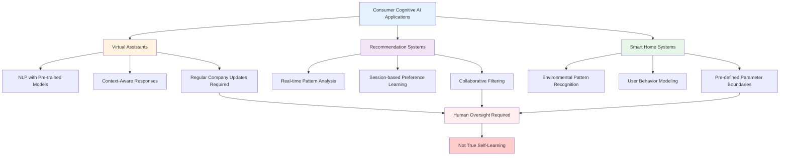

**Virtual Assistants (Limited Adaptation):**
Virtual assistants like Alexa, Siri, and Google Assistant use natural language processing built on pre-trained foundation models to understand and respond to user queries. These systems provide context-aware responses within the boundaries of their training data and can handle follow-up questions in conversational flows. However, the reality is that these systems do not truly learn from individual user interactions in real-time. Instead, technology companies periodically release model updates trained on aggregated user data, requiring centralized retraining by data scientists rather than autonomous self-improvement.

**Recommendation Systems:**
Platforms like Netflix and Amazon employ sophisticated recommendation engines that analyze user behavior patterns in real-time, adjusting suggestions based on viewing history, ratings, and interaction patterns. These systems use collaborative filtering and content-based filtering to predict user preferences. Within a single session, they can adapt recommendations based on immediate user actions. However, this "learning" is constrained to pre-programmed algorithmic adjustments rather than fundamental model evolution, and significant improvements still require human-designed algorithm updates.

**Smart Home Systems:**
Smart thermostats, lighting systems, and security devices learn from environmental patterns and user behavior to optimize home automation. They recognize daily routines, temperature preferences, and usage patterns to make predictive adjustments. Despite appearing intelligent, these systems operate within strictly defined parameters set by their developers. True adaptation to completely novel scenarios or user preferences outside the original design scope requires firmware updates and human intervention.

**References:**
- [10 Ways Tesla Is Using AI [Case Study] [2025] - DigitalDefynd](https://digitaldefynd.com/IQ/tesla-using-ai-case-study/)
- [Real-world gen AI use cases from Google Cloud](https://cloud.google.com/transform/101-real-world-generative-ai-use-cases-from-industry-leaders)
- [Are Alexa And Siri Considered AI? - Bernard Marr](https://bernardmarr.com/are-alexa-and-siri-considered-ai/)
- [Introducing Gemini, your new personal AI assistant - Google](https://gemini.google/assistant/?hl=en)

---

## Slide 9: Evolution: Traditional vs "Cognitive AI"
### The Transformation (With Caveats)

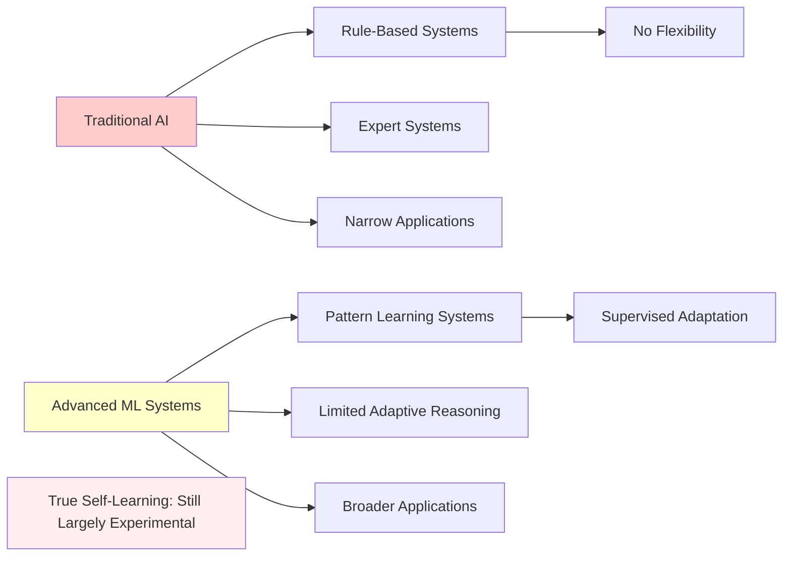

---

## Slide 10: Production Self-Learning Systems - Real Examples
### What Actually Exists Today

**Tesla Autopilot/FSD (Supervised):**
- [Uses billions of miles of real-world driving data](https://www.tesla.com/fsd)
- Continuous model updates from fleet learning
- **Important:** Requires human supervision and periodic model retraining

**[Adaptive AI in Production](https://www.acceldata.io/blog/what-is-adaptive-ai-a-complete-guide-to-self-learning-systems):**
- Real-time fraud detection systems (banks)
- Dynamic pricing algorithms (e-commerce)
- **Limitation:** Adaptation within controlled parameters

**[Continual Learning Research](https://arxiv.org/pdf/2506.03320):**
- Academic research on true continual learning
- **Status:** Mostly experimental, limited production deployment

**References:**
- [Tesla Full Self-Driving (Supervised)](https://www.tesla.com/fsd)
- [Adaptive AI: Self-learning Systems Transforming Industries - AccelData](https://www.acceldata.io/blog/what-is-adaptive-ai-a-complete-guide-to-self-learning-systems)
- [The Future of Continual Learning in the Era of Foundation Models - arXiv](https://arxiv.org/pdf/2506.03320)

---

## Slide 11: How "Adaptive Reasoning" Works in Current AI
### Technical Implementation Reality

**Current Techniques (Not True Reasoning):**
- **Transfer Learning:** Pre-trained models adapted to new domains
- **Few-Shot Learning:** Learning from limited examples
- **Online Learning:** Incremental updates to models
- **Ensemble Methods:** Combining multiple models for better decisions

**Real Implementation Example:**
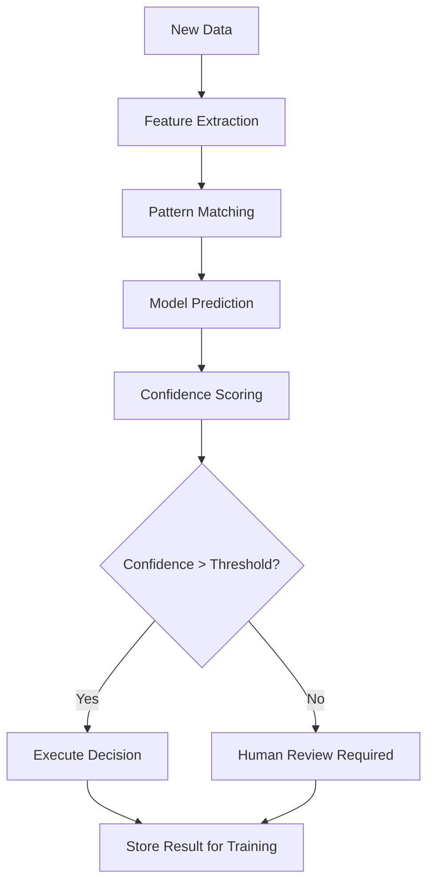

**Limitations:**
- Requires pre-defined decision boundaries
- Cannot reason about truly novel situations
- Needs human oversight for edge cases

**References:**
- [Exploring continual learning for code generation models - Amazon Science](https://www.amazon.science/publications/exploring-continual-learning-for-code-generation-models)

---

## Slide 12: Cognitive AI in Automation Suites
### Current Production Applications

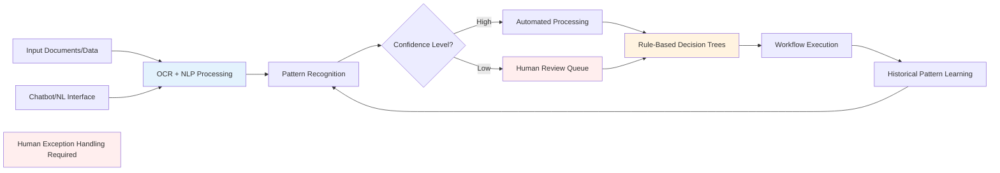

**Intelligent Process Automation (IPA) - Reality:**

Modern IPA systems integrate multiple AI technologies to automate business processes. Document understanding begins with Optical Character Recognition (OCR) combined with Natural Language Processing (NLP) to extract structured information from unstructured documents. The system employs pattern recognition algorithms trained on historical data to classify and route documents. When the AI's confidence level falls below predetermined thresholds, the system automatically escalates to human reviewers, ensuring accuracy in critical decisions.

Exception handling operates through rule-based decision trees that encode business logic and compliance requirements. While these systems can handle routine scenarios effectively, they possess **limited** decision-making capabilities constrained within predefined scenarios. The system cannot autonomously adapt to genuinely novel situations outside its training parameters.

**RPA + ML Integration:**

The combination of Robotic Process Automation with Machine Learning creates more sophisticated automation capabilities. These systems excel at processing unstructured data from emails, forms, and documents that traditional RPA systems struggle with. Natural language interactions through chatbots enable users to interact with automated systems using conversational interfaces. The system continuously learns from historical patterns to optimize workflows, suggesting process improvements based on observed bottlenecks and inefficiencies.

**Production Benefits (Documented):**

Organizations implementing cognitive automation report substantial operational improvements. Industry metrics consistently show 30-50% reduction in manual processing time for routine tasks. Improved accuracy in data extraction reduces errors that often plague manual data entry processes. However, a critical caveat remains: these systems still require human exception handling. Human oversight ensures quality control, manages edge cases, and provides the contextual understanding that current AI systems lack.

**References:**
- [AI revolutionizing industries worldwide - ScienceDirect](https://www.sciencedirect.com/science/article/pii/S2773207X24001386)

---

## Slide 13: Root Cause Analysis - Current AI Capabilities
### What's Possible vs. What's Deployed

**Traditional Approach:**
- Manual investigation
- Limited data correlation
- Time-intensive process

**Current AI-Assisted Approach:**
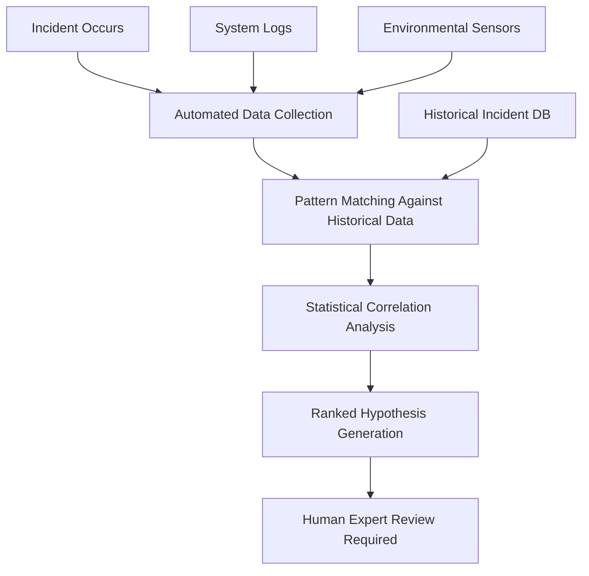

**Real-World Tools:**
- Microsoft Azure Monitor with AI-based anomaly detection
- Splunk's Machine Learning Toolkit
- **Reality:** Provides suggestions, human expertise still required for validation

**References:**
- [AIOps and machine learning in Azure Monitor](https://learn.microsoft.com/en-us/azure/azure-monitor/aiops/aiops-machine-learning)

---

## Slide 14: Predictive Analysis - Current State
### Production Forecasting Systems

**Current AI Capabilities:**
- Time series analysis with machine learning
- Anomaly detection based on historical patterns
- Risk scoring algorithms
- **Limitation:** Predictions within training data distribution

**Production Applications:**
- Equipment maintenance prediction (GE Predix, Siemens MindSphere)
- System failure forecasting (cloud infrastructure monitoring)
- Performance degradation alerts

**Technical Approach:**
- Ensemble of statistical and ML models
- Confidence intervals and uncertainty quantification
- Human oversight for critical decisions

**Accuracy Reality:**
- 70-85% accuracy typical for well-defined problems
- Decreases significantly for novel scenarios

**References:**
- [The 4 Types of Data Analytics Guide - InsightSoftware](https://insightsoftware.com/blog/comparing-descriptive-predictive-prescriptive-and-diagnostic-analytics/)

---

## Slide 15: Prescriptive Analysis - Current Capabilities
### AI-Driven Business Recommendations

**What Current Systems Provide:**
- Optimization within defined constraints
- Scenario analysis based on historical data
- Resource allocation suggestions
- **Important:** Recommendations, not autonomous decisions

**Production Implementation:**
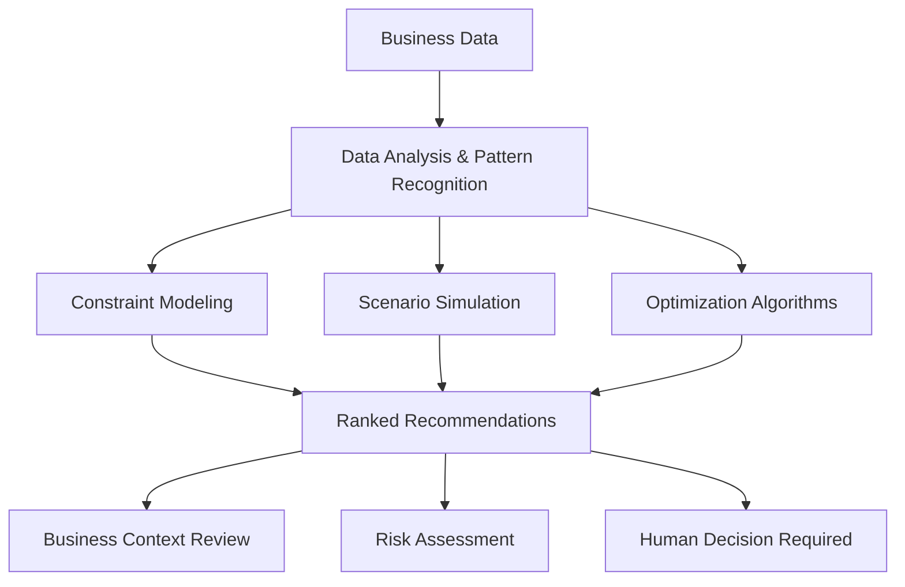

**Real Examples:**
- Supply chain optimization (Walmart, Amazon)
- Investment portfolio recommendations (robo-advisors)
- **Reality:** Human oversight required for strategic decisions

**References:**
- [What Is Prescriptive Analytics? 6 Examples - Harvard Business School](https://online.hbs.edu/blog/post/prescriptive-analytics)
- [The 5 different types of data analytics - Codal](https://codal.com/insights/the-5-different-types-of-data-analytics-and-why-theyre-important)

---

## Slide 16: Integration Reality Check
### Current Limitations of "Cognitive" Systems

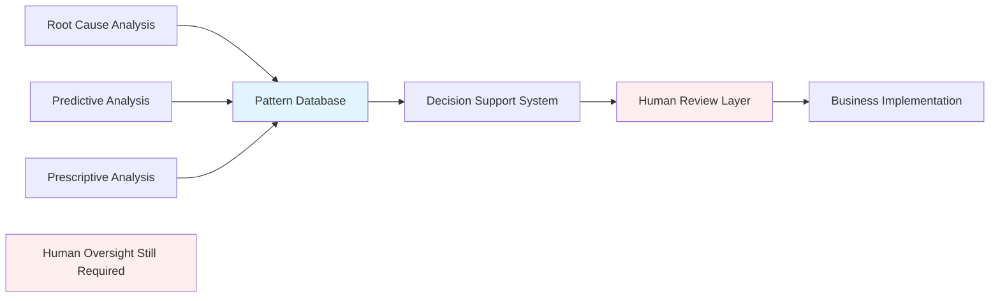

**Current Integration Challenges:**
- Model drift requires continuous monitoring
- Edge cases need human intervention
- Regulatory compliance requires explainability
- Integration complexity across systems

**Success Factors:**
- Clear human-AI role definition
- Robust monitoring and alerting
- Continuous model validation

---

## Slide 17: Challenges and Current Limitations
### Reality vs. Marketing Hype

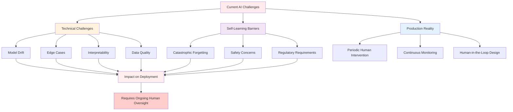

**Technical Challenges:** Model drift occurs when AI performance degrades over time without retraining, often due to changing data distributions in production environments. Edge cases represent scenarios outside the training data distribution where systems fail unexpectedly. Interpretability remains a fundamental challenge, as understanding why an AI system made a particular decision is often difficult with complex neural networks. The classic principle of "garbage in, garbage out" still applies, as data quality issues directly impact AI system performance and reliability.

**True Self-Learning Barriers:** Catastrophic forgetting is a fundamental limitation where new learning erases or significantly degrades previous knowledge in neural networks. Safety concerns arise when autonomous learning systems can develop unexpected behaviors without human oversight, potentially leading to harmful outcomes. Regulatory requirements in many industries, including healthcare, finance, and transportation, mandate human oversight and explainability, preventing fully autonomous AI deployment.

**Current Production Reality:** Most "cognitive AI" systems in production require periodic human intervention for model updates, error correction, and handling exceptional cases. Continuous monitoring is necessary to detect model drift, data quality issues, and performance degradation. Human-in-the-loop design patterns remain the predominant approach for production AI systems, ensuring safety, compliance, and reliability.

**References:**
- [Contra Dwarkesh on Continual Learning - Interconnects](https://www.interconnects.ai/p/contra-dwarkesh-on-continual-learning)

---

## Slide 18: Future Implications - Research Directions
### Where True Cognitive AI Might Lead

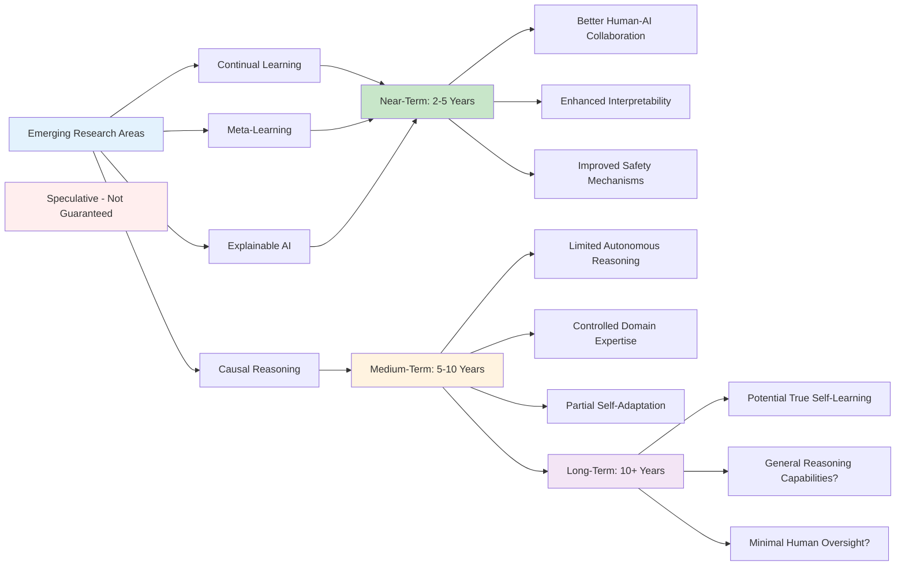

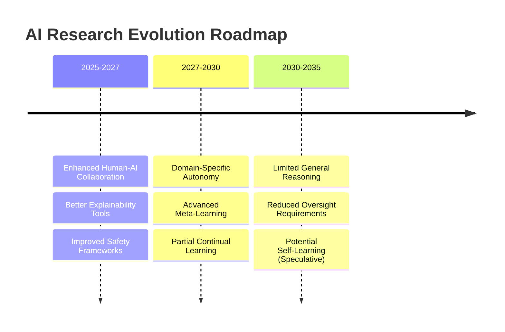

**Emerging Research Areas:** Continual learning aims to enable systems that can learn new information without forgetting previously learned knowledge, addressing the catastrophic forgetting problem. Meta-learning focuses on developing systems that can "learn how to learn," rapidly adapting to new tasks with minimal training data. Causal reasoning seeks to move beyond correlation-based pattern recognition to understanding cause-and-effect relationships. Explainable AI (XAI) aims to make AI decision-making processes transparent and interpretable for human users.

**Potential Timeline (Research Perspective):** Near-term developments (2-5 years) are likely to focus on improving human-AI collaboration tools, enhancing model interpretability, and developing better safety mechanisms. Medium-term advances (5-10 years) may bring limited autonomous reasoning capabilities in controlled domains with well-defined boundaries. Long-term possibilities (10+ years) include potentially true self-learning systems, though these remain highly speculative and uncertain.

**Societal Preparation Needed:** Regulatory frameworks must evolve to address autonomous system deployment, liability, and safety standards. Workforce retraining programs are essential to help workers adapt to AI-augmented roles and new job categories. Ethical guidelines for AI development should address fairness, transparency, accountability, and societal impact.

**References:**
- [Artificial intelligence: A powerful paradigm for scientific research - ScienceDirect](https://www.sciencedirect.com/science/article/pii/S2666675821001041)

---

## Slide 19: Conclusion - Cognitive AI Reality Check
### Key Takeaways (Evidence-Based)

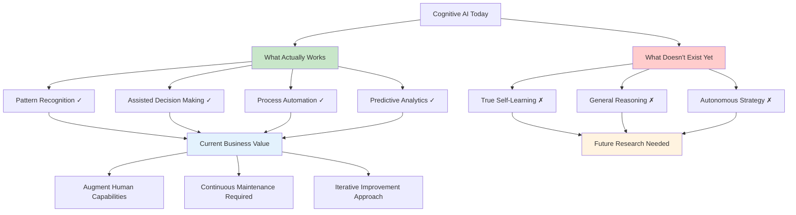

**Current State - What Actually Works:**
1. **Pattern Recognition ✓** Excellent at finding patterns in large datasets, enabling data-driven insights across industries from healthcare diagnostics to financial fraud detection.
2. **Assisted Decision Making ✓** Provides valuable recommendations with human oversight, supporting professionals in complex decision-making processes while maintaining accountability.
3. **Process Automation ✓** Effective for well-defined, repeatable tasks, streamlining operations and reducing manual effort in areas like document processing and workflow management.
4. **Predictive Analytics ✓** Good performance within training data distribution, enabling accurate forecasts for scenarios similar to historical patterns.

**What Doesn't Exist Yet:**
1. **True Self-Learning ✗** Most systems require human-supervised retraining and cannot autonomously improve without data scientists and domain experts guiding the process.
2. **General Reasoning ✗** Current systems cannot reason about truly novel situations or transfer knowledge flexibly across different domains without specific retraining.
3. **Autonomous Strategy ✗** Business decisions still require human judgment, domain expertise, and contextual understanding that AI cannot fully replicate.

**Business Value Today:**
- **Focus on augmentation:** AI should augment human capabilities, not replace them, creating human-AI partnerships that leverage the strengths of both.
- **Expect maintenance:** Continuous maintenance and human oversight requirements are fundamental to production AI systems, not temporary limitations.
- **Plan iteratively:** Approach AI implementation with iterative improvement cycles rather than "set and forget" solutions, acknowledging the need for ongoing refinement.

---

## Slide 20: Questions & Discussion
### Evidence-Based AI Implementation

**Contact Information:**
- Email: [Your Email]
- LinkedIn: [Your Profile]
- Research Papers: [Relevant Publications]

**Key Discussion Points:**
- Realistic expectations for AI implementation in your domain
- Human-AI collaboration strategies
- Measuring ROI with current AI capabilities
- Planning for future AI developments

**Critical Questions to Consider:**
1. What level of human oversight is acceptable in your use case?
2. How will you handle model drift and continuous learning needs?
3. What are your regulatory and compliance requirements?

---

## References by Section

### Part I: Human Cognitive Foundations
1. [History of psychology - Wikipedia](https://en.wikipedia.org/wiki/History_of_psychology)
2. [Wilhelm Wundt - Wikipedia](https://en.wikipedia.org/wiki/Wilhelm_Wundt)
3. [Cognitive Psychology: The Science of How We Think - Verywell Mind](https://www.verywellmind.com/cognitive-psychology-4157181)
4. [The Origins of Psychology - Verywell Mind](https://www.verywellmind.com/a-brief-history-of-psychology-through-the-years-2795245)
5. [Cognitive Approach In Psychology - Simply Psychology](https://www.simplypsychology.org/cognitive.html)

### Part II: Current AI Technology
6. [Tesla Full Self-Driving (Supervised)](https://www.tesla.com/fsd)
7. [Adaptive AI: Self-learning Systems - AccelData](https://www.acceldata.io/blog/what-is-adaptive-ai-a-complete-guide-to-self-learning-systems)
8. [10 Ways Tesla Is Using AI - DigitalDefynd](https://digitaldefynd.com/IQ/tesla-using-ai-case-study/)
9. [Real-world gen AI use cases - Google Cloud](https://cloud.google.com/transform/101-real-world-generative-ai-use-cases-from-industry-leaders)

### Part III: Business Analytics Applications
10. [The 4 Types of Data Analytics - InsightSoftware](https://insightsoftware.com/blog/comparing-descriptive-predictive-prescriptive-and-diagnostic-analytics/)
11. [AIOps and machine learning in Azure Monitor](https://learn.microsoft.com/en-us/azure/azure-monitor/aiops/aiops-machine-learning)
12. [What Is Prescriptive Analytics? - Harvard Business School](https://online.hbs.edu/blog/post/prescriptive-analytics)
13. [The 5 different types of data analytics - Codal](https://codal.com/insights/the-5-different-types-of-data-analytics-and-why-theyre-important)

### Research and Future Directions
14. [The Future of Continual Learning - arXiv](https://arxiv.org/pdf/2506.03320)
15. [Continual Learning Research - Interconnects](https://www.interconnects.ai/p/contra-dwarkesh-on-continual-learning)
16. [AI revolutionizing industries - ScienceDirect](https://www.sciencedirect.com/science/article/pii/S2773207X24001386)
17. [Exploring continual learning - Amazon Science](https://www.amazon.science/publications/exploring-continual-learning-for-code-generation-models)

---

*End of Presentation*