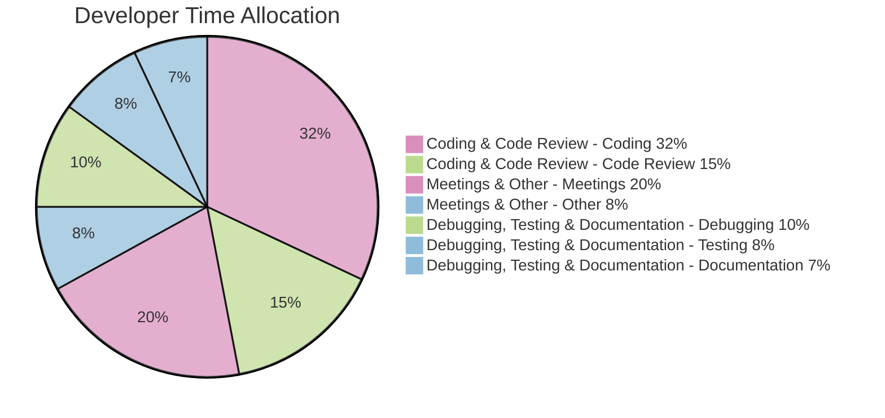
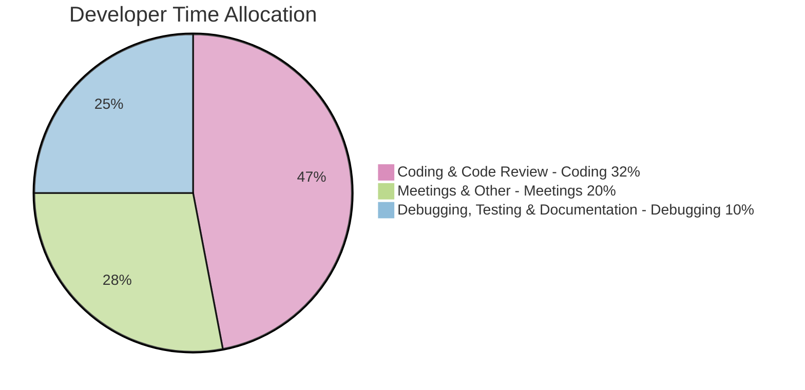

# Developer Time Allocation - Research Findings

## Introduction

This document summarizes research findings on how developers spend their time, based on analysis of recent industry reports and surveys. The goal is to provide a clear picture of where developers invest their effort, beyond just writing code.

## Key Findings

Based on our research, here's a breakdown of how developers typically allocate their time:

* **Coding:** 32% (Source: Hatica, referencing The New Stack & Tidelift survey)
* **Meetings:** 20%
* **Code Review:** 15%
* **Debugging:** 10%
* **Testing:** 8%
* **Documentation:** 7%
* **Other (Admin, Communication, etc.):** 8%

## Visualization - Pie Chart

## Sources

*   [Hatica - Less Effective Coding Hours](https://www.hatica.io/blog/coding-hours-developer-productivity-killer/)
*   [The New Stack & Tidelift Survey](https://www.hatica.io/blog/coding-hours-developer-productivity-killer/)
